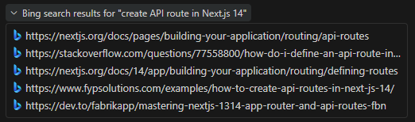
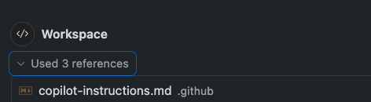
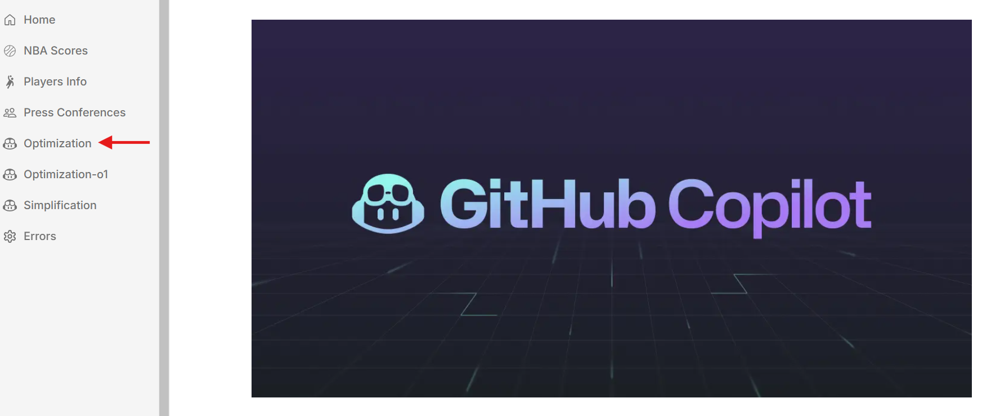
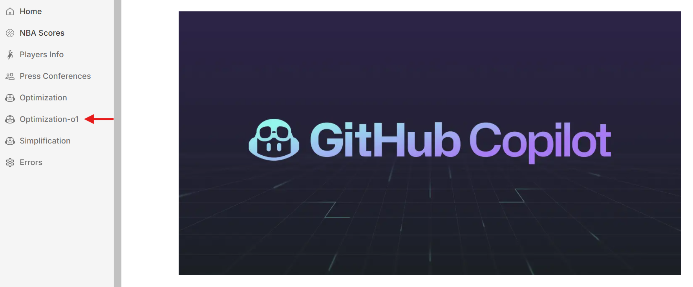
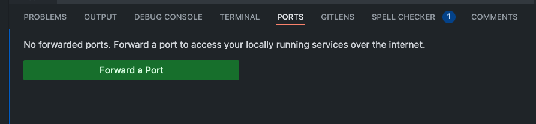
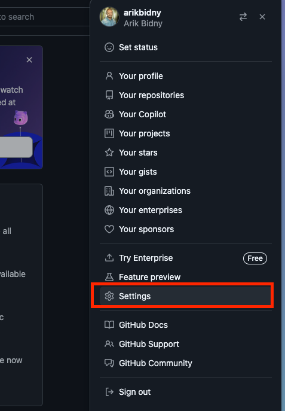
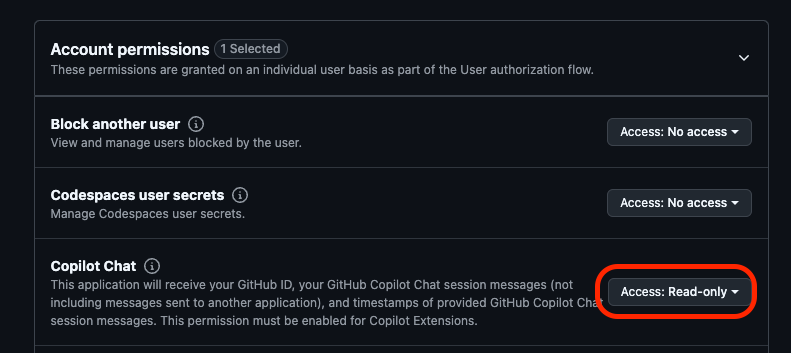
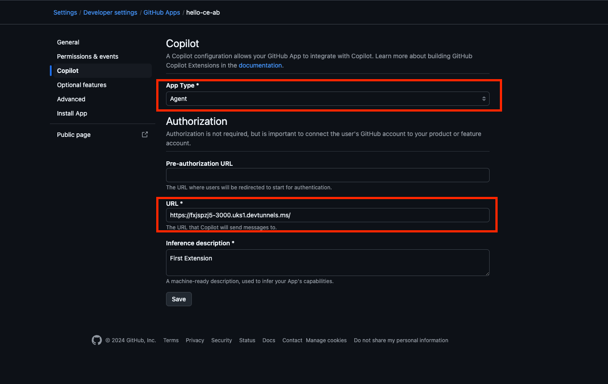
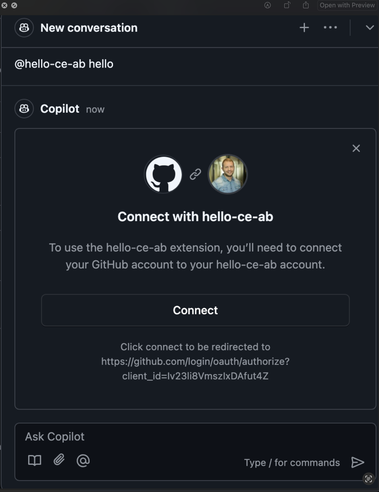

This is a [Next.js](https://nextjs.org) project bootstrapped with [`create-next-app`](https://nextjs.org/docs/app/api-reference/cli/create-next-app).


# Pre-requisites
1. Have Github Copilot license (at least Business)
2. Install and Update Github Copilot & Github Copilot Chat extensions in your IDE
3. Login to Copilot and make sure you get both code completions in the editor, and chat interactions 
4. Install Node.js & npm

# App Description

Introducing GitHub Copilot, your dedicated NBA companion! GC brings you live NBA results and a unique feature: concise summaries of press conferences and post-game insights. Stay updated with key takeaways, player quotes, and team strategies, all in one place.

With real-time updates and customizable notifications, GC is perfect for fans who want the latest NBA action and insider perspectives on each game’s impact and team dynamics.

# Instructions

## Task 1 - Copilot Sport Application with GitHub Copilot

1. **Imagine you are a new developer who just joined the team. You need to explore the project and understand its main components**

   - Open github.com platform and access your repository
   - Click on the GitHub Copilot icon to open a chat
   - Explore the app by asking a questions like:
      - Can you tell me about this repository? 
      - What framework is this repository using? 
      - Where are the API routes handled?
      - Which API routes are included in this repository?
      - Where are the main UI components?
      - What packages does the app use?

---

2.  **Clone the repository to your local environment and run the application**   
    - Clone the repository
    - Open the repository in your IDE.
    - Open the terminal -> View -> Terminal.
    - Install the npm packages - in the root app folder run ```npm install``` in the terminal to install all necessary packages
    - Start the development server by running ```npm run dev ```
    - Open [http://localhost:3000](http://localhost:3000) in your browser to see the result.

---

3. **Role Prompting:**
   
   GitHub Copilot Chat role prompting is a feature that allows developers to define a specific role for Copilot, guiding it to provide more relevant and context-aware assistance. By setting a role prompt, you outline your development goals, project context, and specific tasks, so Copilot tailors its suggestions, code snippets, and guidance to better match your needs. This makes Copilot’s responses more effective, particularly in complex projects or when working with specialized tools or frameworks.
   - Open GitHub Copilot Chat 
   - Prompt: 
   ```
   You are a developer working on a project using Next.js 14. You should be familiar with modern React practices, Next.js’s routing and app directory structure, API routes, and state management. Your tasks involve building efficient, scalable, and user-friendly applications with a focus on performance and responsiveness.
    Responsibilities:
    - UI Components: Build reusable, accessible, and responsive UI components using the latest Next.js conventions and best practices.
    - API Integration: Set up API routes, handle data fetching with SWR or other libraries, and optimize for performance.
    - Optimized Routing: Implement dynamic and nested routing, leveraging Next.js 14 features for route groups, layouts, and parallel routes.
    - Performance Optimization: Use Next.js optimizations, such as lazy loading and server-side rendering, to ensure fast loading and seamless user experiences.
    - Debugging & Testing: Use GitHub Copilot to generate code suggestions, debug issues, and write tests. Familiarity with testing libraries like Jest and React Testing Library is expected.
    
    Goals with GitHub Copilot Chat:

    - Code Assistance: Use Copilot to suggest improvements, refactor code, and speed up repetitive tasks.
    - Documentation: Generate documentation for components and API routes to ensure maintainability.
    - Error Resolution: Ask Copilot for troubleshooting advice or assistance with specific Next.js 14 features or configurations.
    - Optimization Suggestions: Seek suggestions for optimizing components, reducing bundle size, and improving server and client performance.
    ```

---

4. **Explore NextJS technology with GitHub Copilot participants**
   - GitHub Copilot provides the ability (using @github participant) to search within your repository or across the web using Bing search integration. Feel free to ask additional questions to deepen your understanding of Next.js 14 technology.
   - Open GitHub Copilot Chat
   - Manually write the following prompts, one by one (do not copy-paste): 
      - ```@github How do I create an API route in Next.js 14?```
      - ```@github What are Server Actions in Next.js 14?```
      - ```@github How does the routing system work in Next.js 14?```
      - ```@github How to create a ui component in Next.js 14?```  
   > In vscode you can specify @github #web to search the internet with bing.
   
      You can tell that Copilot chat used bing search if you see bing as search resource:
   

   > Troubleshoot: if for some reason you can't see bing used in the search reasults, try to prompt it with @github search the web for... 
---

5. **Custom instructions** 
   
   **<span style="color: yellow;">This task is only supported in vscode and visual studio</span>**
   
   You can enhance Copilot's chat responses by providing it with contextual details about your team's workflow, tools, or project specifics. Instead of manually including this context in every chat query, you can create a custom instructions file that automatically incorporates this information **with every chat request**.
   - In the root of your repository, create a file named ```.github/copilot-instructions.md```
     Create the .github directory if it does not already exist.
   - Add natural language instructions to the file, in Markdown format.
     Whitespace between instructions is ignored, so the instructions can be written as a single paragraph, each on a new line, or separated by blank lines for legibility
   - Instructions: 
     - ```For API routes, use Next.js 14's enhanced API route capabilities. Aim for suggestions that optimize data fetching from our backend services, like fetching game data and user statistics, while keeping it secure and performant.```
     - ```Always include comments with code suggestions.```
     - ```Incorporate error handling in all suggestions, with clear messaging for potential issues and recovery steps to ensure a robust and user-friendly application```
   - In the next task, you'll see how these instructions are used as reference
---

6. **Add Comments to Code:** 
   
   One of the common frustrations for developers is documenting their code properly, but don’t worry—Copilot is here to help!:
   - Open /src/api/nba-results/route.ts
   - Use GitHub Copilot Chat to gain insights into the code. Simply select the code and choose the /explain option for a detailed breakdown.
   - Select the entire function, then press cmd+i on MacOS or ctrl+i on Windows. Next, type /doc.
    > GitHub Copilot will generate a documentation-style function declaration.
   - You can also use Copilot Chat to generate additional documentation. Open GitHub Copilot Chat and enter a prompt: ```Add comments to my code```
   - Add /docs and comments to other api routes
   > When adding comments to the code, ensure that GitHub Copilot Chat applies custom instructions with each request.
   

---
  
7. **Fix your code with GitHub Copilot**
   
   GitHub Copilot assists in fixing code errors by analyzing context to suggest corrections, improving code accuracy and reducing debugging time. It quickly identifies and offers solutions for syntax errors, logic issues, and common mistakes.
   - In the website's UI, navigate to the errors page at http://localhost:3000/errors - this is actually an 'Add NBA player' page, although, when trying to create a new player, there's an error
   - Fill in the form and click on 'Create player' button - you will see an error (404) displayed both in the the IDE console and in the website UI (browser console).
   - Ask Copilot Chat to /explain the error "/explain POST /api/players 404", with the context of /errors/page.tsx
   - Ask Copilot Chat to fix the error with the right context (ask to create the api, while providing the page and players data file - player-info.ts). You should now be able to add players (look at player-info.ts to see the new added player).
   - Once you've fixed the error, enhance the form component's style by selecting the form (in /errors/page.tsx), pressing Ctrl + I on Windows or Cmd + I on MacOS, and asking Copilot to improve the style using TailwindCSS.
   - See the results.

---

8. **Optimize Code With GitHub Copilot**
    
    - Optimize with GPT 4o:
      - Open Optimization page:
      
      - Hold on until the page finishes loading.
      - Your goal is to optimize the code using the GPT 4o model
      - Find the API route in the code (you can use #codebase to help locate it).
      - **Choose chat model GPT-4o**
      - Select the code and type optimize to initiate the process.
      - Make the necessary adjustments, then try accessing the page again.
   - Optimize with o1 model:
      - Open Optimization-o1 page
       
      - Hold on until the page finishes loading
      - Your goal is to optimize the code using the o1-preview model
      - Find the API route in the code (you can use #codebase to help locate it).
      - Select the countToken function and press ctrl+i (windows) / cmd + i (macos) and **switch to o1-preview model**
      - Type /optimize
      - Make the necessary adjustments, then try accessing the page again
      > You could start by optimizing the code with the GPT-4 model to evaluate the results.

---

9. **GitHub Copilot Code Reviews**
   
   **<span style="color: yellow;">This task is only supported in vscode</span>**

   GitHub Copilot can review your code and provide feedback. Where possible, Copilot's feedback includes suggested changes which you can apply with a couple of clicks.
   - Open the /app/(dashboard)/errors/page.tsx file 
   - In MacOS press cmd + shift + p / in Windows press ctrl + shift + p to open the command pallette and prompt: GitHub Copilot: Review and comment
   - GitHub Copilot will suggest code improvements, which you can choose to accept, reject, or skip to move on to the next suggestion. You'll also find the complete suggestions in the comments section.

---

10. **Generate Unit Tests using GitHub Copilot**
   Test-driven development and unit test creation aren't always prioritized by development teams. However, GitHub Copilot can significantly reduce the effort required for these tasks by automatically generating unit tests.
   - Open the coaches.py file located in the /flask directory at the root of the repository.
   - The file contains a simple Flask API route that returns a list of NBA coaches.
   - To run the app just run ```python coaches.py``` - You can test the api by GET request to http://localhost:8080/api/coaches
   - Add unit tests to coaches.py by using prompt engineering techniques, such as the one-shot method. Provide a sample unit test structure example in Copilot Chat to guide the model, then proceed to generate the tests.
   - Run the tests
       > You can generate tests by typing /tests participant in GitHub Copilot Chat

---

11. **Lets Create a Player info feature, Under lib folder there is a a file called player-info.ts with nba player stats, you need to build an api route and react component based on player stats using file attach option in the chat, the route already exists under /src/app/api/player-info/route.ts**
   - In GitHub Copilot Chat, use @github chat participant to learn how to handle routes in a Next.js 14 application.
   - Open /src/app/api/player-info/route.ts file
   - Open GitHub Copilot Chat and attach the files /src/lib/player-info.ts and /src/app/(dashboard)/player-info/page.tsx as references. You can do this by using the #file participant command or by pressing the attachment button in the chat.
   - Now, create a route based on the player-info file that fetches only the id, name, team, weight, height, and position properties. In the same command, ask Copilot to generate a component that displays a list of player information with all these fields,Ensure each player is displayed in a separate card.
      > Use Tailwindcss and shadcn in your prompt to style the output
   - You can test your api route with GET request: http://localhost:3000/api/player-info
   - Open the http://localhost:3000/players-info and see the results, refactor the code if needed. 
  
---

12. **Add a Press conferences summarization feature using Azure OpenAI GPT-4o model**
   Your goal is to summarize each of the press conferences that located in localhost:3000/press-conferences page.
   - Open /src/app/api/summarize/route.ts file 
   - You have a boilerplate for POST request
     - The request need to receives a transcription from the request
     - use openai sdk with Azure implementation to create a summarization 
     - use github copilot prompt engineering techniques like Input/Output Format -> Error Handling -> Control the Structure of the code in the file declaration - to help copilot to provide a better suggestion
     - in .env.local file we already configured an Azure OpenAI endpoint and the key - use the process.env.NEXT_PUBLIC_AZURE_OPENAI_ENDPOINT for the endpoint, process.env.NEXT_PUBLIC_AZURE_OPENAI_KEY for the KEY, use api version - 2024-10-01-preview, and deployment name: gpt-4o
   - Test the api route with POST request to http://localhost:3000/api/summarize - make sure to path the transcription into the request for test to work
   -  Open GitHub Copilot chat 
      -  prompt: ```#codebase Where is the implementation of the Press Conference Card located in my code?``` the #codebase Searches through the codebase and pulls out relevant information for the query.
      -  Once GitHub Copilot locates the file, click on the file name in the chat to be redirected to it.
      -  The "Summarize with AI" button is already in your code but isn’t functional yet. Your goal is to use Copilot to create a handler function that calls the API route, summarizes the transcript, and displays it at the bottom of the card. As a bonus, try implementing a loading state to disable the button and show a loading indicator while the summary is being generated.
         > You can implement this feature using either chat or inline code. Use @github #web to assist you in completing the task.
      - Test the ui feature. 

## Task 2 - Copilot Agent Mode
**<span style="color: yellow;">This task is only supported in vscode insiders</span>**

1.  **Add Stadiums feature using GitHub Copilot Agents** 
    GitHub Copilot’s new agent mode is capable of iterating on its own code, recognizing errors, and fixing them automatically. It can suggest terminal commands and ask you to execute them. It also analyzes run-time errors with self-healing capabilities.
    -  Open GitHub Copilot Chat, select Copilot Edits Tab, from the drop down menu select Agent mode and select Claude 3.5 Sonnet model.
    -  Include a prompt to generate a new Stadium feature—clearly specify the exact instructions for your desired action. For example:
       
      ```
      Let's enhance this application by adding an NBA Stadiums page.
       1. First, create a JSON file containing sample stadium data.
       2. Then, set up a Next.js API route to serve the stadium data from the JSON file.
       3. Build a React component that displays the stadium information as cards.
       4. Add a navigation link to this new component in the main navigation page.
       5. Use Tailwind CSS and ShadCN components to style the UI.
     ```
     - Review the output and monitor live changes in your codebase. The agent will analyze your file structure, determine appropriate locations for adding files, and handle the additions accordingly. Be sure to accept or reject each step suggested by the agent.
     - Open the app to verify that the Stadiums navigation tab, the REST API endpoint, and the corresponding React component have been successfully added.

## Task 3 - Build your first GitHub Copilot Extension
1. Through a growing partner ecosystem, Copilot Extensions enables developers to build and deploy to the cloud in their natural language with their preferred tools and services, all without leaving the IDE or GitHub.com. With Copilot and now Copilot Extensions, developers can stay in the flow longer, uplevel their skills, and innovate faster.
   - In VSCode please open the GitHub Copilot Chat 
   - Type the prompt: ```Generate a Dockerfile to containerize a Next.js 14 application``` and see the results
   - Now do the same using Docker extension ```@Docker Generate a Dockerfile to containerize a Next.js 14 application``` and test the results 
   - The Docker extension offers additional capabilities for working with containers, including features such as:
     - Learn about containerization
     - Generate the correct Docker assets for your project
     - Open a pull request with the assets to save you time
     - Find project vulnerabilities with Docker Scout
  
2. Building your first GitHub Copilot extension involves creating custom features that enhance the capabilities of GitHub Copilot, tailored to specific tasks or workflows.
   - Navigate to the /custom-copilot-extension folder.
   - In the CLI, execute the command ```npm init -y``` to initialize an npm project.
   - Create index.js file 
   - Open GitHub Copilot chat and prompt: ```Add an ES module; create server using http; handle the get method```
   - Insert the code to your index.js file 
   - Install npm copilot extensions package: ```npm i @copilot-extensions/preview-sdk``` 
   - You can follow the SDK github repo for more details: https://github.com/copilot-extensions/preview-sdk.js
   - Customize your code to use the package ( example output ):
      ```javascript
      import http from 'http';
      import { createTextEvent, createDoneEvent } from "@copilot-extensions/preview-sdk"

      const server = http.createServer((req, res) => {
      if (req.method === 'GET') {
         res.writeHead(200, { 'Content-Type': 'text/plain' });
         res.end('Hello, world!');
      } else {
         res.write(createTextEvent("Hello, world!"));
         res.write(createTextEvent("This is my first Copilot extensions!"));
         res.end(createDoneEvent());
      }
      });

      const PORT = 3000;
      server.listen(PORT, () => {
      console.log(`Server is running on port ${PORT}`);
      });
      ```
    - Run ```npm start``` 
    - In VSCode cli open PORTS TAB and forward the a port
    
    - Set the port to be publicly accessible.
    - Go to your GitHub platform 
    - Open settings
      
    - Select Developer settings
    - Under GitHub Apps Click Create GitHub App: 
      - Enter github app name ( must be unique )
      - Describe your extension app
      - Home page url: http://github.com
      - Callback url: https://github.com
      - Remove checkbox for Expire user authorization tokens
      - Remove checkbox for Webhook -> Active
      - Allow read-only permission to Account permissions -> Copilot Chat -> Access: Read-only
          
      - Click Create GitHub App
    - After the creation completed press Copilot Tab
      - Choose App Type: Agent
      - Url: Provide the url from port forwarding configuration in your idea cli
        
      - Result:
      
    - Make sure your app is running
    - In GitHub platform open the Github copilot chat and type @<your-extension-name> hello
    - Authorize the app
      
    - Try the extension
    - Bonus: Leverage your previous application task to call one of the API endpoints and return the results within your Copilot extension.
    
     


